# CISO Assistant -- Database Entity Relationship Diagrams

> Auto-generated from the Django model layer.
> 70+ concrete models across 10+ apps.

## Conventions

| Symbol | Meaning |
|--------|---------|
| `PK` | Primary key |
| `FK` | Foreign key |
| `||--o{` | One-to-many |
| `}o--o{` | Many-to-many |
| `||--||` | One-to-one |

Only the most important columns are shown per entity (id, name, key FKs, status/type discriminators). Every model inherits `id` (UUID), `created_at`, and `updated_at` from `AbstractBaseModel` unless noted otherwise.

---

## 1. High-Level Domain Overview

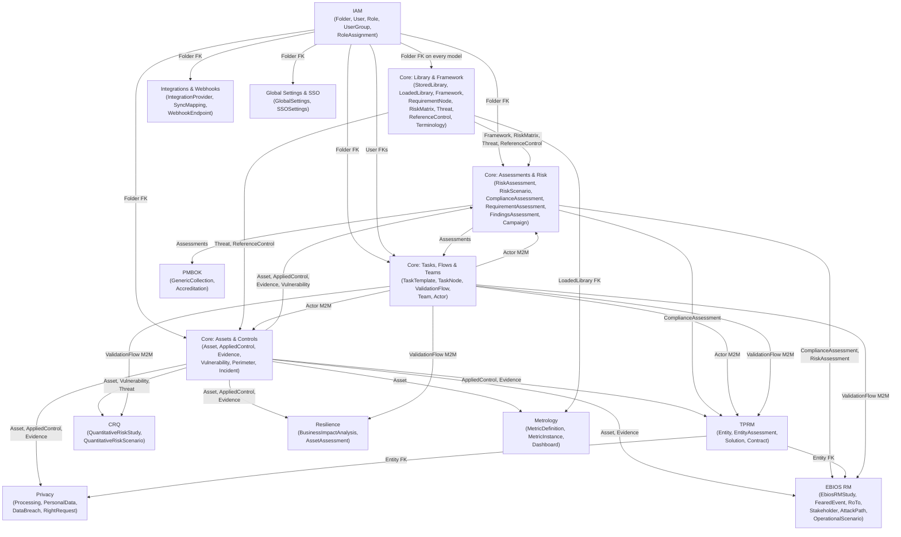

---

## 2. IAM (Identity & Access Management)

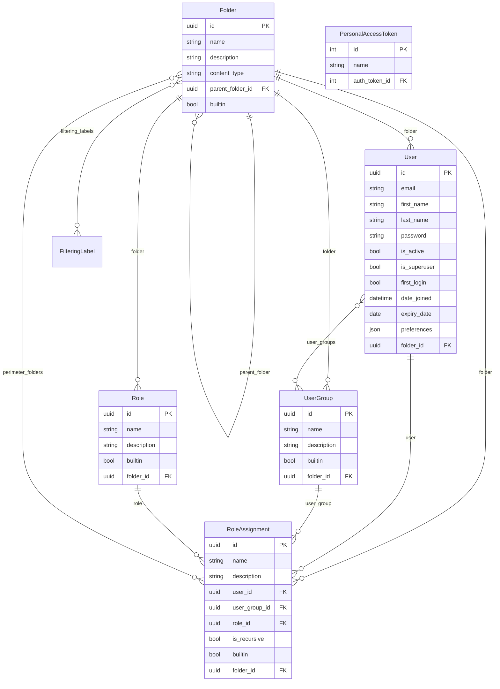

---

## 3. Core -- Library & Framework

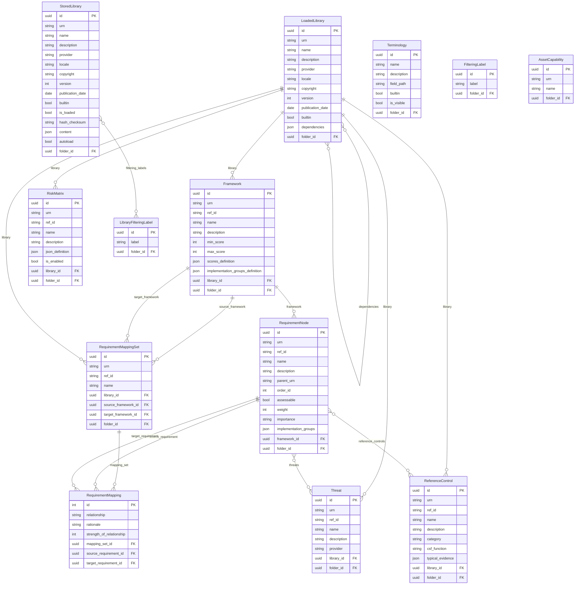

---

## 4. Core -- Assets & Controls

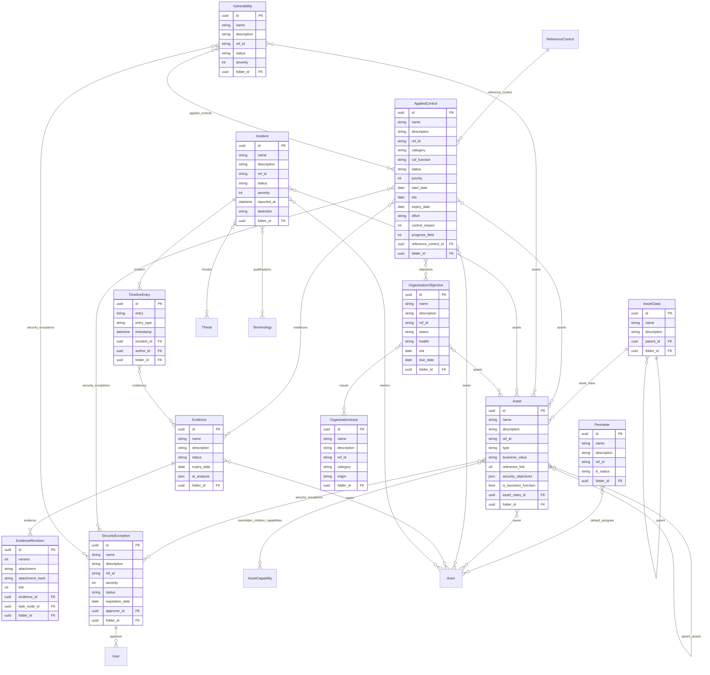

---

## 5. Core -- Assessments & Risk

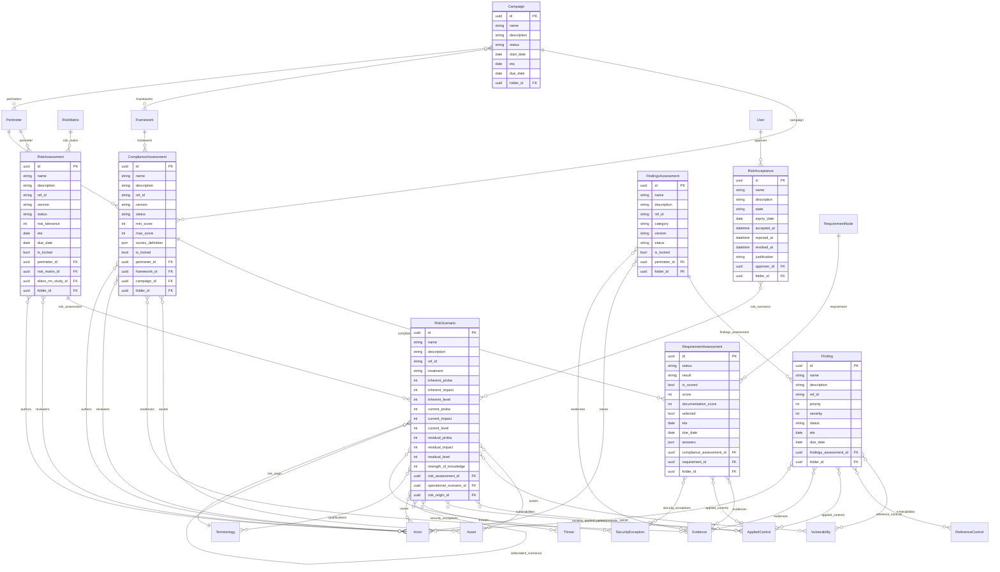

---

## 6. Core -- Tasks, Flows & Teams

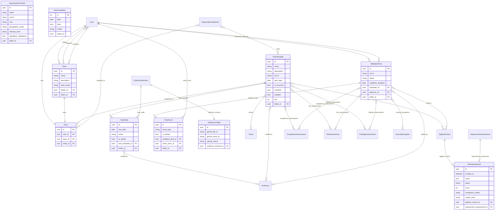

---

## 7. EBIOS RM

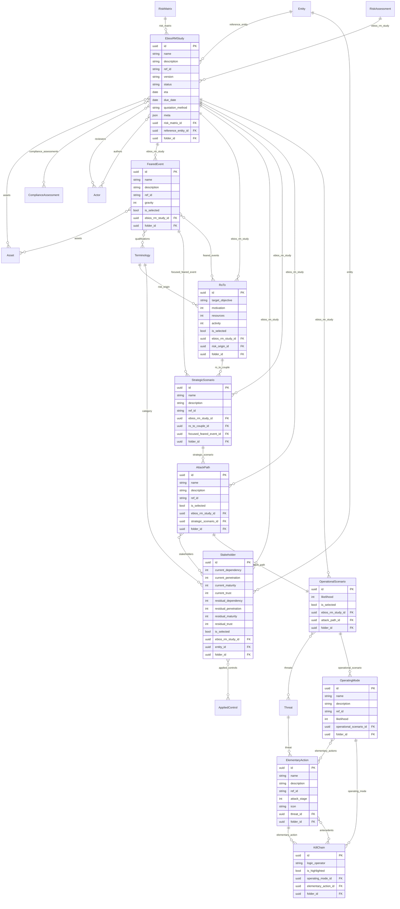

---

## 8. TPRM (Third-Party Risk Management)

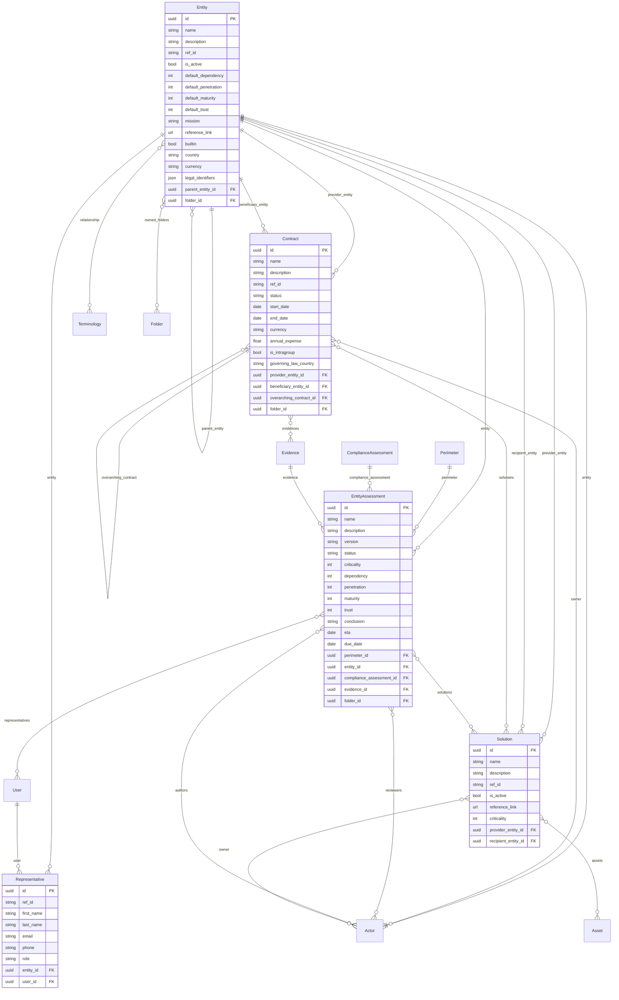

---

## 9. Privacy

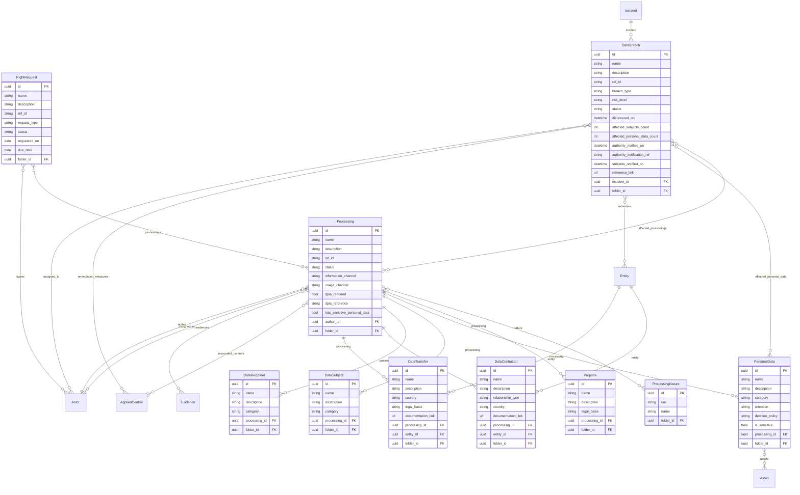

---

## 10. CRQ (Cyber Risk Quantification)

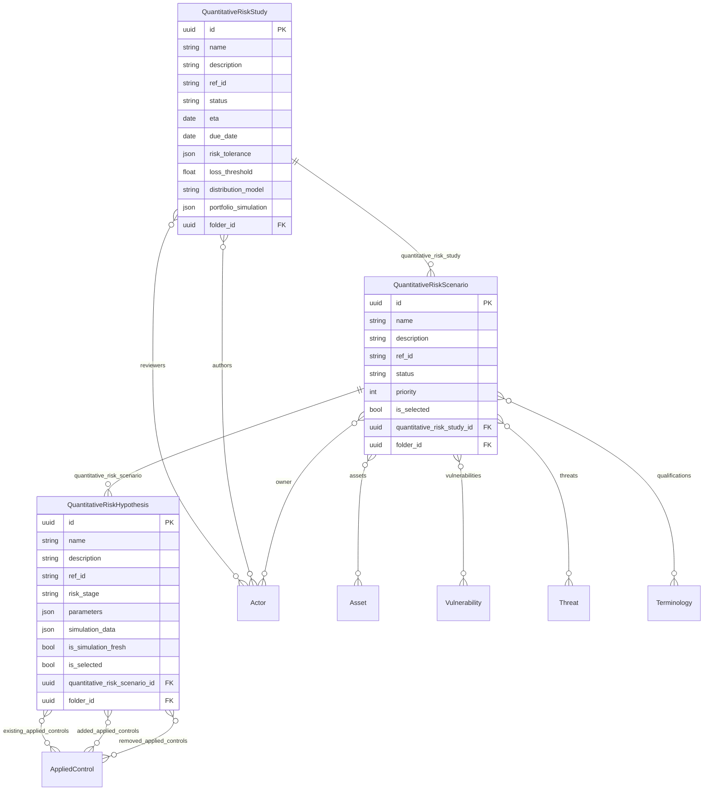

---

## 11. Resilience (Business Impact Analysis)

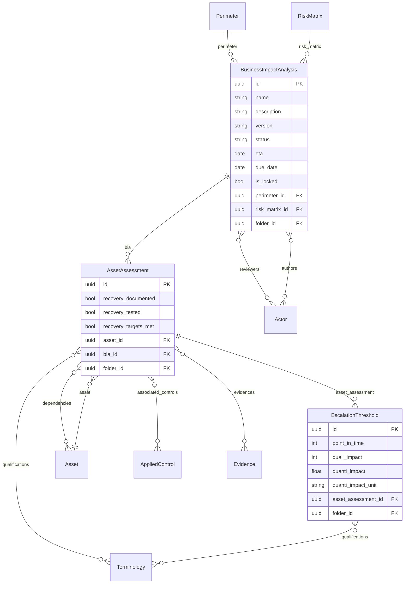

---

## 12. Metrology (Metrics & Dashboards)

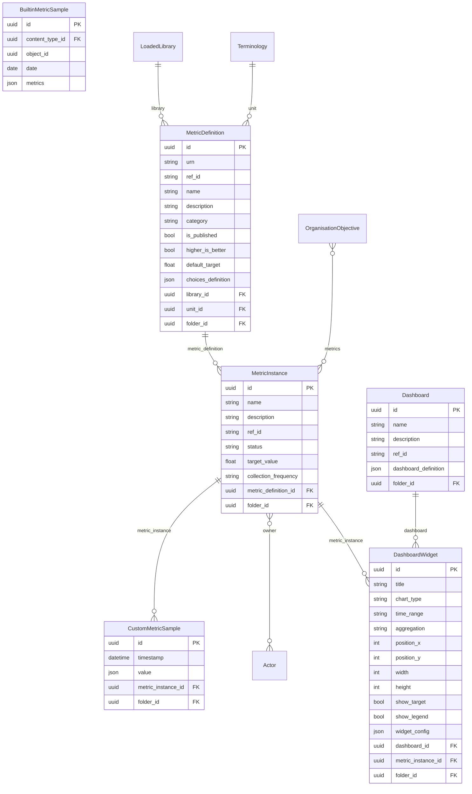

---

## 13. PMBOK (Project Management)

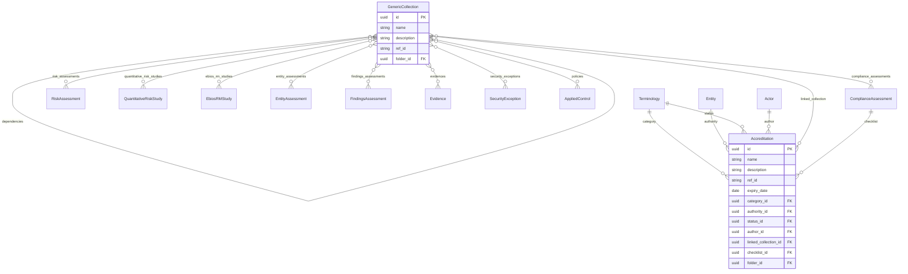

---

## 14. Integrations & Webhooks

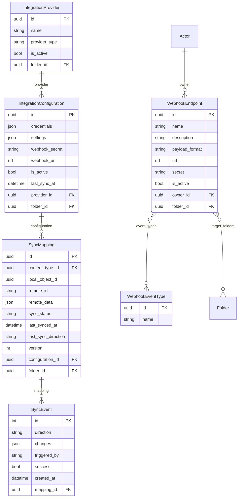

---

## 15. Global Settings & SSO

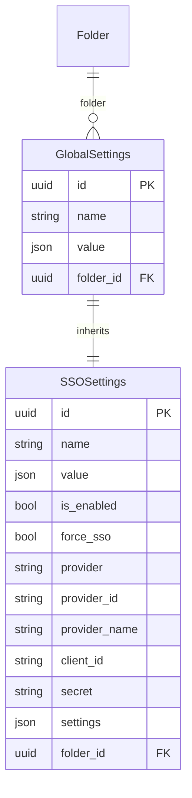
