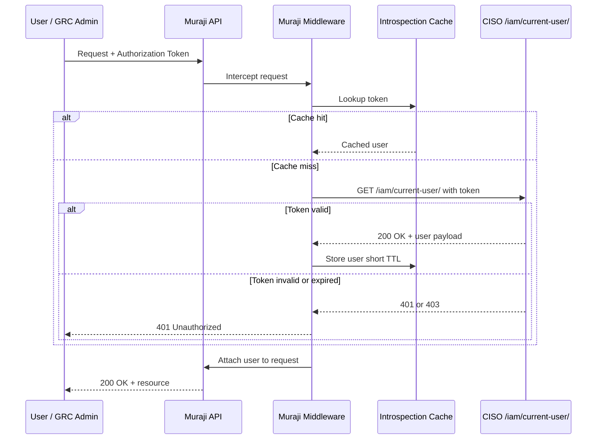
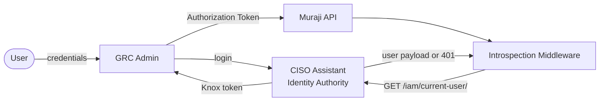

# Muraji authentication via CISO token introspection

## Context

GRC Admin authenticates its users by calling CISO Assistant's login endpoint and receives back a Knox token. Muraji is a third API provider whose routes are currently unprotected. To keep a single consistent session across the three services, Muraji must accept the same CISO-issued token that GRC Admin already holds, rather than introducing its own login or its own token store.

## Overview

In this pattern, Muraji delegates authentication to CISO Assistant. CISO remains the single identity authority; Muraji never issues, stores, or refreshes tokens of its own.

On every incoming request, a thin middleware inside Muraji performs the following steps:

1. Extracts the bearer credential from the `Authorization: Token ...` header.
2. Looks up the token in a short-lived local cache. If a fresh result exists, it is used directly.
3. On a cache miss, Muraji calls CISO's `GET /iam/current-user/` endpoint, forwarding the same `Authorization` header.
4. If CISO responds with `200 OK`, the returned user payload is cached briefly and attached to the request context; the request is allowed to proceed.
5. If CISO responds with any non-success status, Muraji rejects the request with `401 Unauthorized`.

The same token that GRC Admin obtained from CISO's login endpoint is therefore sufficient to access Muraji, with no additional sign-in step and no separate credential for the user to manage.

## Sequence diagram

## Component diagram

CISO sits at the centre as the only component that owns identities, credentials, and token lifecycles. GRC Admin and Muraji are both relying parties that consume the same token.

## Why this pattern

- **No duplicate user store.** Muraji has no users table, no password hashes, and no token table of its own.
- **Single logout.** Revoking a token in CISO invalidates access to GRC Admin and Muraji simultaneously, within the cache TTL.
- **Consistent session.** The same `Authorization` header travels unchanged across all three services.
- **Stateless Muraji.** Muraji carries no auth state beyond an ephemeral cache, which simplifies scaling and deployment.
- **No changes to CISO.** The pattern relies only on the existing `/iam/current-user/` endpoint that CISO's own frontend already uses.

## Operational considerations

- **Cache TTL.** The introspection result should be cached for a short window, typically 30 to 60 seconds. Long enough to eliminate per-request latency, short enough that logout and permission changes propagate quickly.
- **Logout propagation.** Because Knox invalidates tokens server-side, the next cache miss naturally rejects a revoked token. If near-instant revocation is required, a revocation event channel from CISO to Muraji can invalidate cached entries on demand.
- **Transport security.** Every hop that carries the token must use TLS. Muraji's outbound call to `/iam/current-user/` should also travel over a trusted network path, ideally inside a private network or VPC.
- **Authentication vs authorization.** CISO answers the question "who is this user and are they authenticated?". Muraji is still responsible for deciding what that user is allowed to do on Muraji's own resources, keyed on the user identifier returned by CISO.
- **Failure mode on CISO outage.** If CISO is unreachable, the middleware must fail closed and return `401`, not fall back to anonymous access. Monitoring on the introspection call is important.
- **Latency budget.** The first request for a given token adds one round-trip to CISO. Subsequent cached requests add only a local cache lookup.

## Out of scope

This document covers only Pattern A, the in-process middleware variant. It does not cover reverse-proxy or forward-auth variants, full SSO via OIDC or SAML, cross-domain cookie sharing, or the mechanics of how CISO itself issues and stores tokens. Those concerns are handled by CISO's existing authentication stack and are transparent to Muraji under this pattern.
